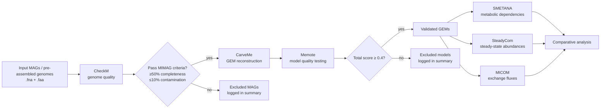

# Snakemake workflow: `microbial-community-modeling`

[](https://snakemake.github.io)
[](https://github.com/brunosate21-a11y/Repositrio-Codigo/actions?query=branch%3Amain+workflow%3ATests)
[](https://docs.conda.io/en/latest/)
[](https://snakemake.github.io/snakemake-workflow-catalog/docs/workflows/brunosate21-a11y/Repositrio-Codigo)
[](LICENSE)

> A modular and reproducible **Snakemake** workflow for genome-scale metabolic modeling of microbial communities, starting from metagenome-assembled genomes (MAGs) or pre-assembled genomes.

---

## Table of Contents

- [Overview](#overview)
- [Workflow diagram](#workflow-diagram)
- [Workflow steps](#workflow-steps)
  - [1. Input data preparation](#1-input-data-preparation)
  - [2. Genome quality assessment with CheckM](#2-genome-quality-assessment-with-checkm)
  - [3. Automatic GEM reconstruction with CarveMe](#3-automatic-gem-reconstruction-with-carveme)
  - [4. Model quality testing with Memote](#4-model-quality-testing-with-memote)
  - [5. Community-level simulation](#5-community-level-simulation)
  - [6. Comparative analysis](#6-comparative-analysis)
- [Tools integrated](#tools-integrated)
- [Requirements](#requirements)
- [Quick start](#quick-start)
- [Configuration](#configuration)
- [Input data](#input-data)
- [Output files](#output-files)
- [Deployment options](#deployment-options)
- [Workflow profiles](#workflow-profiles)
- [Project structure](#project-structure)
- [Authors](#authors)
- [Citation](#citation)
- [References](#references)

---

## Overview

The functional study of microbial communities increasingly relies on the integration of metagenomic data with **constraint-based metabolic modeling**. Although several tools exist to reconstruct genome-scale metabolic models (GEMs) and to simulate community-level metabolism, these steps are typically distributed across separate programs with heterogeneous inputs, outputs, and assumptions. This fragmentation compromises reproducibility, traceability, and the reuse of analytical procedures.

This workflow addresses that gap by integrating, in a **single Snakemake pipeline**, the steps that follow MAG assembly:

1. **Genome quality assessment** of input MAGs/genomes,
2. **Automatic reconstruction** of genome-scale metabolic models,
3. **Model quality control**, and
4. **Community-level metabolic simulation** with three complementary tools (SMETANA, SteadyCom, MICOM).

The pipeline is organised around **modular Snakemake rules**, each encapsulating a specific tool, its parameters, and its conda environment. This means individual components can be replaced or adapted without modifying the rest of the workflow, allowing the same pipeline to be applied to different metagenomic datasets and biological contexts.

> **Scope.** This workflow starts from **already-assembled MAGs or genomes**. It does *not* perform read trimming, assembly, or binning — those steps must be done upstream.

---

## Workflow diagram

The figure below summarises the overall structure of the pipeline, from input MAGs to the comparative analysis of community-level results.


For a step-by-step textual description and the role of each rule in the `Snakefile`, see [Workflow steps](#workflow-steps) below.

<details>
<summary><b>Interactive (Mermaid) version of the workflow</b></summary>



</details>

---

## Workflow steps

### 1. Input data preparation

The workflow expects MAGs or pre-assembled genomes placed under `data/mags/`, with two files per organism:

| File | Purpose | Used by |
|------|---------|---------|
| `{mag}.fna` | Nucleotide assembly (FASTA) | CheckM |
| `{mag}.faa` | Predicted protein sequences (FASTA) | CarveMe |

The list of MAGs to be processed is declared in `config/config.yaml` under the `MAGS:` key (see [Configuration](#configuration)).

### 2. Genome quality assessment with CheckM

[**CheckM**](https://ecogenomics.github.io/CheckM/) is used to assess the **completeness** and **contamination** of each input genome, following the [MIMAG/MISAG recommendations](https://doi.org/10.1038/nbt.3893) by Bowers et al.

- **Why this matters.** The quality of a MAG directly conditions the metabolic reconstruction downstream. Incomplete MAGs may omit essential genes from key pathways, while contaminated MAGs can introduce spurious functional associations.
- **What the rule does.** The `checkm` rule runs `checkm lineage_wf` on each genome and produces a `quality.tsv` file per MAG. The `filter_checkm` rule then aggregates results, applies the configured thresholds, and produces:
  - `results/checkm/checkm_summary.tsv` — all MAGs with completeness, contamination, and `PASS`/`FAIL`.
  - `results/checkm/filtered_mags.txt` — names of MAGs that passed quality control.
- **Default thresholds** (configurable in `config/config.yaml`):

| Metric | Default | MIMAG reference |
|--------|---------|-----------------|
| `min_completeness` | `50.0` % | medium quality ≥ 50 %, high quality ≥ 90 % |
| `max_contamination` | `10.0` % | medium quality < 10 %, high quality < 5 % |

> ⚠️ The CheckM step requires `{mag}.fna` files. In the current default `Snakefile`, the CheckM targets are commented out so the pipeline can also run from `.faa` files alone. Uncomment the corresponding lines in `workflow/Snakefile` to enable CheckM execution.

### 3. Automatic GEM reconstruction with CarveMe

[**CarveMe**](https://carveme.readthedocs.io/) reconstructs genome-scale metabolic models using a top-down approach based on a curated universal model. From each `{mag}.faa` file, the `carveme` rule produces an SBML model (`results/gems/{mag}.xml`) that uses standardised [BiGG Models](http://bigg.ucsd.edu/) identifiers, ensuring interoperability with downstream community simulation tools.

Two parameters control reconstruction (see `config/config.yaml`):

| Parameter | Default | Description |
|-----------|---------|-------------|
| `solver` | `scip` | Linear programming solver used by CarveMe and SMETANA. |
| `media` | `M9` | Medium used for gap-filling so that the model is able to grow. |

### 4. Model quality testing with Memote

[**Memote**](https://memote.readthedocs.io/) is used to perform an **automated quality assessment** of each reconstructed GEM. This step is crucial because automatic reconstruction does not guarantee a sound model — common issues include unrealistic biomass production, stoichiometric inconsistencies, or incomplete annotations.

For each model, the `memote` rule produces two outputs:

- `results/memote/{mag}/report.html` — a human-readable HTML report covering consistency, annotation, biomass, and stoichiometry tests.
- `results/memote/{mag}/score.json` — the underlying machine-readable scores, used by the workflow itself for filtering.

Two aggregation rules then summarise the results:

- `memote_summary` → `results/memote/memote_summary.tsv` — total score plus the four sub-scores (Consistency, Annotation, Biomass, Stoichiometry) for every model.
- `filter_memote` → `results/memote/memote_quality.tsv` and `results/memote/filtered_models.txt` — applies the `min_total_score` threshold (default `0.4`) and lists the models that passed.

> Only models that pass the Memote threshold should be carried forward to community simulation in a curated analysis. The workflow currently runs the simulation tools on all reconstructed models for convenience; users can restrict downstream rules to `filtered_models.txt` by editing `rule all` or by using a wildcard constraint.

### 5. Community-level simulation

Validated GEMs are then used as input to **three complementary community simulation tools**, each answering a different biological question:

| Tool | Question addressed | Output |
|------|-------------------|--------|
| **SMETANA** | What metabolic dependencies and cross-feeding interactions exist between community members? | `results/smetana/global.tsv` (global scores), `results/smetana/detailed.tsv` (pairwise) |
| **SteadyCom** | What relative abundances are consistent with a stable, steady-state community growth rate? | `results/steadycom/abundances.tsv` |
| **MICOM** | What exchange fluxes between organisms emerge under a cooperative trade-off between community and individual growth? | `results/micom/exchange_fluxes.tsv` |

Each tool runs as an isolated Snakemake rule with its own conda environment, so they can be updated, replaced, or disabled independently.

### 6. Comparative analysis

The final step is the **comparative analysis** of the outputs of the three tools, focusing on:

1. Metabolites potentially **shared or competed** between organisms.
2. Metabolic **dependencies** inferred by SMETANA.
3. Growth rates and **relative abundances** estimated by SteadyCom and MICOM.

This comparison highlights convergent signals (results supported by more than one method) and tool-specific findings, providing a more robust interpretation of community-level metabolism than any single tool alone.

---

## Tools integrated

| Tool | Version pinned | Purpose | Conda env |
|------|----------------|---------|-----------|
| [CheckM](https://ecogenomics.github.io/CheckM/) | `1.2.2` | Genome quality assessment (completeness, contamination) | `workflow/envs/checkm.yaml` |
| [CarveMe](https://carveme.readthedocs.io/) | `1.6.1` | Automatic genome-scale metabolic model reconstruction | `workflow/envs/carveme.yaml` |
| [Memote](https://memote.readthedocs.io/) | `0.16.1` | Standardised quality testing of metabolic models | `workflow/envs/memote.yaml` |
| [SMETANA](https://smetana.readthedocs.io/) | `1.3.0` | Inference of metabolic interactions and cross-feeding | `workflow/envs/smetana.yaml` |
| [SteadyCom](https://github.com/hongzhonglu/SteadyCom) | via cobra `0.26.3` | Steady-state community abundances | `workflow/envs/steadycom.yaml` |
| [MICOM](https://micom-dev.github.io/micom/) | `0.35.0` | Metagenome-scale community modeling, exchange fluxes | `workflow/envs/micom.yaml` |

---

## Requirements

- [**Snakemake**](https://snakemake.readthedocs.io/) ≥ 8.0.0
- [**Conda**](https://docs.conda.io/) (or [Mamba](https://mamba.readthedocs.io/) — strongly recommended for faster environment resolution)
- Optional: [**Apptainer / Singularity**](https://apptainer.org/) for containerised execution

All tool-specific dependencies (CheckM, CarveMe, Memote, SMETANA, SteadyCom, MICOM) are declared in the `workflow/envs/` directory and installed automatically by Snakemake on first run.

---

## Quick start

```bash
# 1. Clone the repository
git clone https://github.com/brunosate21-a11y/Repositrio-Codigo.git
cd Repositrio-Codigo

# 2. Place your MAGs (.fna and .faa) under data/mags/
#    and list them in config/config.yaml under the MAGS: key.

# 3. (Optional) Inspect the planned execution
snakemake --dry-run

# 4. Run the full pipeline with conda environments
snakemake --cores 4 --sdm conda
```

The first run downloads and builds all conda environments, which may take some time. Subsequent runs reuse the cached environments.

---

## Configuration

All workflow parameters live in [`config/config.yaml`](config/config.yaml):

```yaml
MAGS:
  - Ecoli_K12_MG1655
  # - Another_MAG
  # - Yet_Another_MAG

solver: scip       # LP solver used by CarveMe / SMETANA (scip, cplex, gurobi)
media: M9          # gap-filling medium for CarveMe

quality_filters:
  checkm:
    min_completeness: 50.0     # %
    max_contamination: 10.0    # %
  memote:
    min_total_score: 0.4       # 0–1
```

Additional information about input data and configuration is provided in [`config/README.md`](config/README.md).

---

## Input data

Place input files under `data/mags/` using the MAG name as prefix:

```
data/mags/
├── Ecoli_K12_MG1655.fna     # nucleotide assembly — required for CheckM
├── Ecoli_K12_MG1655.faa     # predicted proteins — required for CarveMe
├── MyOtherMAG.fna
└── MyOtherMAG.faa
```

Each MAG identifier must be listed in `config/config.yaml` under `MAGS:`.

> 💡 If you only have nucleotide assemblies, you can predict proteins with [Prodigal](https://github.com/hyattpd/Prodigal) before running this workflow.

---

## Output files

After a successful run, the `results/` directory will contain:

```
results/
├── checkm/                              # (when CheckM targets are enabled)
│   ├── {mag}/quality.tsv
│   ├── checkm_summary.tsv
│   └── filtered_mags.txt
├── gems/
│   └── {mag}.xml                        # CarveMe SBML models
├── memote/
│   ├── {mag}/report.html                # human-readable report
│   ├── {mag}/score.json                 # machine-readable scores
│   ├── memote_summary.tsv               # aggregated scores across MAGs
│   ├── memote_quality.tsv               # scores + PASS/FAIL
│   └── filtered_models.txt              # models above min_total_score
├── smetana/
│   ├── global.tsv                       # community-wide scores
│   └── detailed.tsv                     # pairwise interactions
├── steadycom/
│   └── abundances.tsv                   # steady-state abundances
└── micom/
    └── exchange_fluxes.tsv              # inter-species exchange fluxes
```

Execution logs for each rule are written to the `logs/` directory, with one file per `{mag}`.

---

## Deployment options

Change the working directory to the repository root:

```bash
cd path/to/Repositrio-Codigo
```

Adjust options in the default config file `config/config.yaml`. Before running the complete workflow, you can perform a **dry run** to see which jobs would be executed:

```bash
snakemake --dry-run
```

Run the workflow with the bundled test data using **conda**:

```bash
snakemake --cores 2 --sdm conda --directory .test
```

Run the workflow with **apptainer** / **singularity** (combined with conda for tool installation):

```bash
snakemake --cores 2 --sdm conda apptainer --directory .test
```

Generate an HTML report of an executed run (with run statistics and provenance):

```bash
snakemake --report report.html
```

---

## Workflow profiles

The `profiles/` directory can hold any number of [workflow-specific profiles](https://snakemake.readthedocs.io/en/stable/executing/cli.html#profiles) — for example, a default profile, a SLURM cluster profile, or a cloud profile. See the [`profiles/README.md`](profiles/README.md) for details on how to add one.

---

## Project structure

<details>
<summary><b>Click to expand the full directory tree</b></summary>

```
Repositrio-Codigo/
├── config/
│   ├── README.md
│   └── config.yaml                  # main configuration
├── data/
│   └── mags/                        # input MAGs (.fna and .faa)
├── profiles/
│   └── README.md
├── workflow/
│   ├── Snakefile                    # main entry point, includes all rules
│   ├── envs/                        # one conda env per tool
│   │   ├── carveme.yaml
│   │   ├── checkm.yaml
│   │   ├── memote.yaml
│   │   ├── micom.yaml
│   │   ├── smetana.yaml
│   │   └── steadycom.yaml
│   ├── rules/                       # one Snakemake rule file per tool
│   │   ├── carveme.smk
│   │   ├── checkm.smk
│   │   ├── memote.smk
│   │   ├── micom.smk
│   │   ├── smetana.smk
│   │   └── steadycom.smk
│   └── scripts/                     # Python scripts called by the rules
│       ├── carveme.py
│       ├── checkm.py
│       ├── filter_checkm.py         # quality filter for CheckM
│       ├── filter_memote.py         # quality filter for Memote
│       ├── memote.py
│       ├── memote_summary.py
│       ├── micom.py
│       ├── smetana.py
│       └── steadycom.py
├── .test/                           # minimal test configuration
├── CHANGELOG.md
├── LICENSE                          # MIT
└── README.md
```

</details>

---

## Authors

- **Bruno Ferreira** — Universidade do Minho, Portugal — [pg58814@uminho.pt](mailto:pg58814@uminho.pt)
- **Artur Gomes** — Universidade do Minho, Portugal — [pg55692@alunos.uminho.pt](mailto:pg55692@alunos.uminho.pt)
- **Andreia Salvador** — Centre of Biological Engineering (CEB), Universidade do Minho, Portugal — [asalvador@ceb.uminho.pt](mailto:asalvador@ceb.uminho.pt)
- **Óscar Dias** — Centre of Biological Engineering (CEB), Universidade do Minho, Portugal — [odias@ceb.uminho.pt](mailto:odias@ceb.uminho.pt)

---

## Citation

If you use this workflow in a publication, please cite the URL of this repository and acknowledge the underlying tools listed in [Tools integrated](#tools-integrated). A reference to the Snakemake engine is also expected:

> Mölder, F., Jablonski, K. P., Letcher, B., Hall, M. B., Tomkins-Tinch, C. H., Sochat, V., Forster, J., Lee, S., Twardziok, S. O., Kanitz, A., Wilm, A., Holtgrewe, M., Rahmann, S., Nahnsen, S., & Köster, J. *Sustainable data analysis with Snakemake.* F1000Research 10:33 (2021). <https://doi.org/10.12688/f1000research.29032.3>

---

## References

1. Parks, D. H. *et al.* **CheckM: assessing the quality of microbial genomes recovered from isolates, single cells, and metagenomes.** *Genome Research* 25(7), 1043–1055 (2015). <https://doi.org/10.1101/gr.186072.114>
2. Bowers, R. M. *et al.* **Minimum information about a single amplified genome (MISAG) and a metagenome-assembled genome (MIMAG) of bacteria and archaea.** *Nature Biotechnology* 35(8), 725–731 (2017). <https://doi.org/10.1038/nbt.3893>
3. Machado, D., Andrejev, S., Tramontano, M. & Patil, K. R. **Fast automated reconstruction of genome-scale metabolic models for microbial species and communities (CarveMe).** *Nucleic Acids Research* 46(15), 7542–7553 (2018). <https://doi.org/10.1093/nar/gky537>
4. King, Z. A. *et al.* **BiGG Models: A platform for integrating, standardizing and sharing genome-scale models.** *Nucleic Acids Research* 44(D1), D515–D522 (2016). <https://doi.org/10.1093/nar/gkv1049>
5. Lieven, C. *et al.* **MEMOTE for standardized genome-scale metabolic model testing.** *Nature Biotechnology* 38(3), 272–276 (2020). <https://doi.org/10.1038/s41587-020-0446-y>
6. Zelezniak, A. *et al.* **Metabolic dependencies drive species co-occurrence in diverse microbial communities (SMETANA).** *PNAS* 112(20), 6449–6454 (2015). <https://doi.org/10.1073/pnas.1421834112>
7. Chan, S. H. J., Simons, M. N. & Maranas, C. D. **SteadyCom: Predicting microbial abundances while ensuring community stability.** *PLoS Computational Biology* 13(5), e1005539 (2017). <https://doi.org/10.1371/journal.pcbi.1005539>
8. Diener, C., Gibbons, S. M. & Resendis-Antonio, O. **MICOM: Metagenome-scale modeling to infer metabolic interactions in the gut microbiota.** *mSystems* 5(1), e00606-19 (2020). <https://doi.org/10.1128/mSystems.00606-19>
9. Zorrilla, F., Buric, F., Patil, K. R. & Zelezniak, A. **metaGEM: reconstruction of genome scale metabolic models directly from metagenomes.** *Nucleic Acids Research* 49(21), e126 (2021). <https://doi.org/10.1093/nar/gkab815>
10. Köster, J. & Rahmann, S. **Snakemake — a scalable bioinformatics workflow engine.** *Bioinformatics* 28(19), 2520–2522 (2012). <https://doi.org/10.1093/bioinformatics/bts480>
